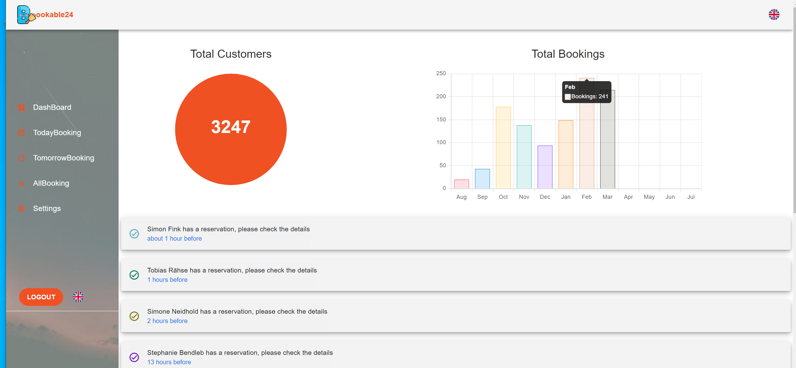
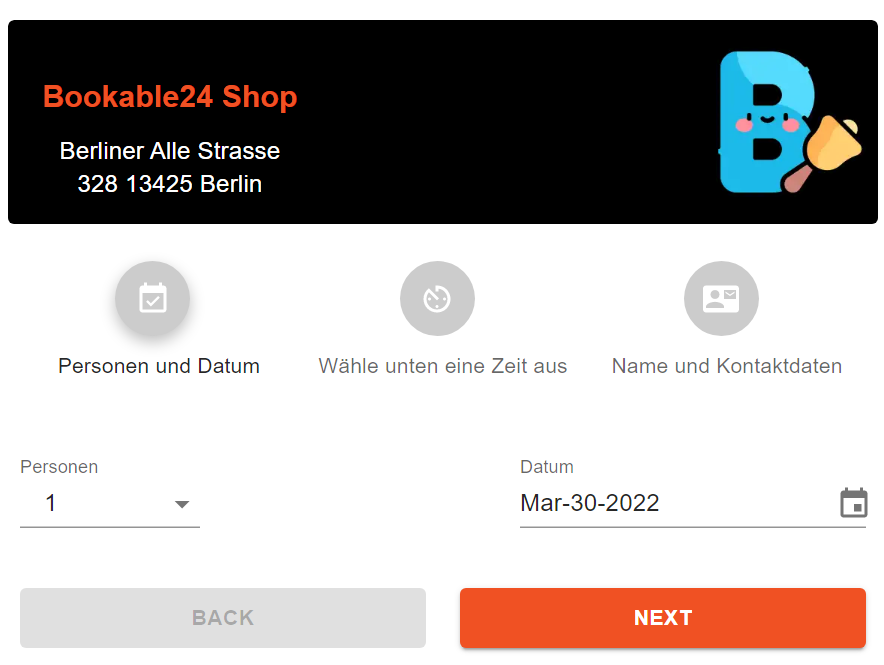
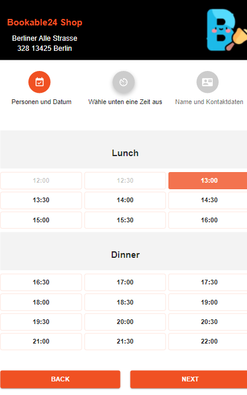

<h1 align="center">
   
  
   
  Booking Room
   
</h1>

<h4 align="center">A Booking System <a href="https://bookable24.de/" target="_blank">Bookable24</a>.</h4>

  <a href="#environment-variables">Environment variables</a> •
  <a href="#key-features">Key Features</a> •
  <a href="#screen-shots">Key Features</a> •

### Environment variables (REQUIRED)

- BASE_URL
  •••••••
- CONTENTFUL_ACCESS_TOKEN
  •••••••
- GOOGLE_ACCESS_TOKEN
  •••••••
- GOOGLE_CLIENT_ID
  •••••••
- GOOGLE_CLIENT_SECRET
  •••••••
- GOOGLE_REDIRECT_URI
  •••••••
- GOOGLE_REFRESH_TOKEN
  •••••••
- MAIL_PASSWORD
  •••••••
- MAIL_USER
  •••••••
- MONGO_PASSWORD
  •••••••
- MONGO_URI
  •••••••
- PREVIEW_CONTENTFUL_ACCESS_TOKEN
  •••••••

## Key Features

- [x] Automatically generate an unique URL for each client
  - URL based on the client's name
- [x] User registration (Sign Up)
  - Allow client request a demo registering based on email, phone number, username, password, and other relevant details.
- [x] Login
  - Clients should be able to log in using user-name and password.
- [x] Client Admin board
  1. A visualization summary of all booking.
  2. Today, tomorrow, after tomorrow booking.
  3. Setting, enable/disable schedule the booking
  4. View details of a particular booking
- [x] Booking notification
  - A Email will send directly to client's email to confirm booking
- [x] Booking cancel.

- ### [WIP] Iframe to embed to client website.

### Screen shots

    
    
    

### Gatsby BoilerPlate

- Material-ui
- React-i18next

## Dev notes :

- [Share modules, files in lambda functions ](https://www.netlify.com/blog/2021/08/12/how-to-include-files-in-netlify-serverless-functions/)

- Use normal `img` tag instead of any IMG GatsBy Image to render some static images, avoid splash when we rerender a child component.

-Fix: `Received non-boolean attribute` [official](https://styled-components.com/docs/api#transient-props)
